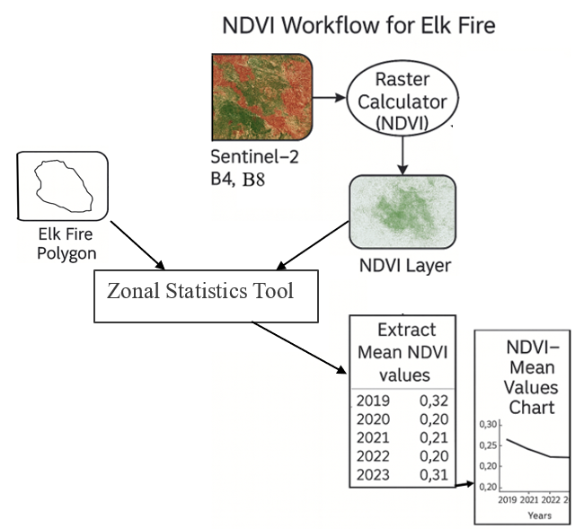
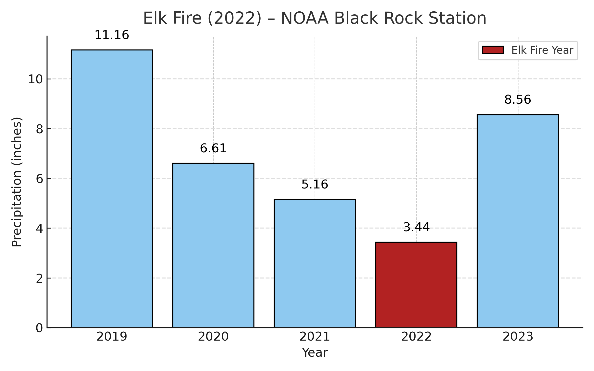

# Developed Fire Risk Model for Joshua Tree National Park  
### Analyzing desert fire trends using open-source 10 m Sentinel-2 NDVI time series  

**GIS Focus:** Raster analysis, remote sensing, environmental GIS  
**Tools:** ArcGIS Pro, Sentinel-2, Copernicus Data Hub, NOAA climate data  

My workflow offers land managers a repeatable, data-driven method to monitor fine-fuel accumulation and identify high-risk fire conditions in arid desert ecosystems.

---

## **Overview**

Wildfires in Joshua Tree National Park have increased with the spread of invasive annual grasses such as **Red Brome**, **Cheatgrass**, and **Split Grass**. These grasses form continuous fine-fuel beds that persist on the landscape for multiple years, allowing fire to carry through otherwise sparse desert vegetation.

This project analyzes five years of **Sentinel-2 NDVI data (2019–2023)** to identify vegetation patterns that preceded the **2022 Elk Fire**, with the goal of quantifying what a high-risk fire scenario looks like in a desert environment.

---

## **Key Goals**

- **Quantify environmental conditions that create peak wildfire risk** in Joshua Tree National Park so land managers can identify high-risk periods and justify proactive mitigation efforts.  
- **Advance understanding of desert fire dynamics** by examining how wet-year biomass growth followed by multi-year drying creates conditions favorable for fire spread.  

---

## **Methods**

To monitor vegetation conditions leading up to the 2022 Elk Fire, I analyzed time-series **Sentinel-2 satellite imagery** using **ArcGIS Pro**. Sentinel-2 imagery was selected because it provides **open-source 10 m spatial resolution data**, which is detailed enough to capture vegetation changes in desert environments without requiring costly aerial imagery.

All satellite imagery was downloaded from the **Copernicus Data Hub**, which provides free public access to Sentinel-2 data from the European Space Agency. I selected cloud-free images from **late March** for each year between **2019 and 2023**, aligning image acquisition dates with the end of the invasive grass growing season.

For each image, I calculated the **Normalized Difference Vegetation Index (NDVI)** using the red (Band 4) and near-infrared (Band 8) bands, which are sensitive to vegetation greenness and biomass. NDVI rasters were generated in ArcGIS Pro using the **Raster Calculator** tool.

Using a polygon of the **Elk Fire burn scar**, I summarized vegetation conditions within the study area using the **Zonal Statistics** tool to extract mean NDVI values for each year. These values were compiled into a table and graphed to visualize vegetation trends over time.

### **Workflow Overview**

*Workflow diagram showing the process of downloading Sentinel-2 imagery, calculating NDVI using red and near-infrared bands, and extracting mean NDVI values within the 2022 Elk Fire burn scar using zonal statistics.*

---

## **Results**

### **Vegetation Greenness Trends (NDVI)**

To understand how vegetation conditions changed before the 2022 Elk Fire, I analyzed mean **Normalized Difference Vegetation Index (NDVI)** values within the Elk Fire burn scar from **2019–2023**. NDVI values range from 0 to 1, with higher values indicating greener and more abundant vegetation.

The results show a clear decline in vegetation greenness leading up to the fire. NDVI values were highest in **spring 2019**, following a wet year that promoted strong growth of invasive annual grasses that persist on the landscape for multiple years. From **2020 through 2022**, NDVI steadily declined, indicating that vegetation was drying and curing over multiple years. The Elk Fire occurred in **late May 2022**, after three consecutive years of low NDVI values, suggesting that fuels were both abundant and dry at the time of ignition.

*This chart synthesizes five years of Sentinel-2 NDVI data within the Elk Fire burn scar, showing a clear decline in vegetation greenness from 2019 to 2022. The pattern reflects a transition from wet-year biomass accumulation to multi-year drying, which contributed to increased fuel availability prior to the fire.*

---

To better interpret the observed NDVI trends, I synthesized vegetation greenness data with annual precipitation records from a nearby NOAA weather station.

### **Precipitation Patterns and Context**

Annual precipitation data provides important context for the NDVI trends. Rainfall was highest in **2019**, corresponding with peak NDVI values observed that spring. Precipitation then declined in **2020, 2021, and 2022**, contributing to prolonged drying of both invasive grasses and native shrubs across the landscape.

Although **2023 experienced unusually high rainfall**, NDVI values within the Elk Fire scar did not immediately rebound to pre-fire levels. This is likely because the fire removed much of the existing vegetation, and early regrowth is dominated by invasive annual grasses rather than mature shrubs or Joshua trees.

*This precipitation chart provides climatic context for the NDVI trends, highlighting a wet year in 2019 followed by multiple drier years preceding the 2022 Elk Fire. Comparing precipitation and NDVI patterns illustrates how vegetation growth followed by prolonged drying created high-risk fire conditions.*

---

### **Key Quantitative Finding**

Using open-source **10 m Sentinel-2 imagery**, this analysis detected a **47% decline in NDVI values between 2019 and 2022** within the burned area. Despite the relatively coarse resolution compared to sub-meter imagery, the workflow successfully captured meaningful vegetation trends in a sparse desert environment.

---

## **GIS Application & Visualization Extension**

To further explore the spatial and temporal patterns of wildfire in Joshua Tree National Park, I developed an **ArcGIS StoryMap** that integrates this analysis with an interactive burn scar time series map.

The StoryMap visualizes fire perimeter polygons moving through time across different vegetation communities, highlighting that **Cheatgrass-dominated habitats accounted for a large proportion of burned areas**. The narrative links fire occurrence with preceding wet years, reinforcing the grass–fire cycle observed in the quantitative analysis.

🔗 **ArcGIS StoryMap:**  
https://arcg.is/1LC1Ou

---

## **Conclusion**

This project demonstrates that wildfire risk in Joshua Tree National Park is highest **not immediately after wet years**, but after **multiple years of drying that follow strong vegetation growth**. Wet winters promote the spread of invasive annual grasses, while subsequent drought years allow those grasses — along with native shrubs — to cure and persist as fine fuels.

By combining satellite remote sensing, raster-based spatial analysis, and time-series visualization, this workflow translates complex environmental data into **actionable insights** that can support proactive fire management decisions in arid landscapes.

---

### **Project Relevance**

This project demonstrates my experience working with **quantitative satellite datasets**, performing **raster-based spatial analysis and geoprocessing in ArcGIS Pro**, and **synthesizing multi-source environmental data** to identify patterns and generate insights relevant to wildfire risk assessment.
